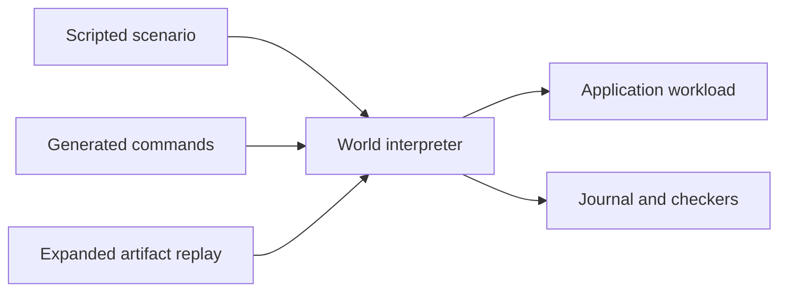

# 1 DST World reference

`petrus.testing.dst` runs application-owned workloads under a deterministic
schedule. A workload implements `ScenarioProfile`; the World owns ordering,
logical budgets, generation revocation, checker cadence, artifacts, and replay.
The workload owns application semantics and the runtime objects it constructs.
The test kit is supported across projects through its defining module and is
not re-exported from the `petrus` package root.

The glossary calls the application adapter a
[Workload](../project/glossary/workload.md); the Python protocol remains
`ScenarioProfile`, and artifact identities still use `profile`. The Python
`Timeline` class helps an author drive one World generation. It is separate
from the [Timeline](../project/glossary/timeline.md) stored in a Net document.
The code names used below are the shipped API spellings.

Read [correctness and operating practice](deterministic-simulation-testing.md)
for Petrus's properties, fault boundaries, campaigns, and qualification limits.
Use the separate [process runner](dst-process-runner-v1.md) when a profile call
can block. The [test-kit decision](../project/decisions/records/2026-08-17T2249Z-ship-a-supported-cross-project-dst-test-kit.md)
owns the support promise.

## 1a Versions and compatibility

| World input or retained format | API / artifact version | Replay-result version | Contract difference |
| --- | --- | --- | --- |
| `BudgetV4` with a resource-reporting profile | 4 | 2 | Measures and bounds profile-owned retained state. |
| `Budget` | 3 | 2 | Still authors v3, with optional seeded provenance. |
| Retained v2 artifact | 2 | 2 | Exact failed-operation retention, no seeded provenance. |
| Retained v1 artifact | 1 | 1 | Authored endings only, no failed-operation retention. |

The API identity is `petrus.testing.dst/vN`; the expanded artifact is
`petrus-dst-world` version N. The result format is
`petrus-dst-world-replay-result`. The loader selects the exact strict model
and rejects unknown versions. Version notes preserve the frozen differences:
[v1](dst-world-v1.md), [v2](dst-world-v2.md), [v3](dst-world-v3.md),
[v4](dst-world-v4.md). The shared rules below apply across versions unless a
section names a later version.

API, artifact, profile, checker, and runner identities evolve independently.
A change to a supported method's meaning, required profile method, value shape,
or interpreter policy requires a new API identity. An artifact field or
operation change requires a new artifact version. Profile and checker identities
each pin an exact name, positive version, and SHA-256 implementation digest;
`ScenarioRegistry` resolves all three fields exactly. Changes to application
commands, observations, faults, construction, or checking require a new profile
or checker identity/digest.

The internal [Scenario v1 envelope](dst-scenario-v1.md) and hosted
`implementation-free-v1` simulation have separate contracts. Their formats and
profiles are not aliases for World artifacts.


<a id="one-interpreter-three-inputs"></a>
## 1b One interpreter, three inputs

There is one normalized execution path:



`Timeline` is an imperative authoring facade. Python control flow, helpers,
assertions, and `run_until` predicates remain ordinary test code. They are not
serialized. Every state-affecting operation still crosses `World`; the
artifact retains the normalized command, queue choice, logical instant,
observation, checker result, lifecycle operation, and final disposition that
actually occurred. Replay executes those expanded operations through the same
interpreter without importing the originating scenario or consulting a seed.

<a id="profile-contract"></a>
## 1c Profile contract

A `ScenarioProfile[Generation]` owns one opaque generation and these methods:

| Method | Obligation |
| --- | --- |
| `validate(command)` | Fail loud on an unknown name, payload, or profile identity before application. Return the exact normalized `Command`. |
| `validate_fault(fault)` | Fail loud on an unsupported fault name, target, occurrence, disposition, or payload before activation. Return the exact normalized `Fault`. |
| `create(context)` | Construct a fresh generation and return `GenerationStart` with only currently eligible detached follow-up proposals. |
| `load(context)` | Reconstruct a fresh generation from retained configuration, durable stores, and modeled external truth. Return eligible detached follow-ups. |
| `apply(generation, command, context)` | Perform one application-defined atomic operation and return strict detached `ApplyResult` data plus eligible follow-up proposals. |
| `observe(generation, request, context)` | Validate the named request and return detached strict JSON. Never return a live generation or mutable runtime handle. |
| `drop(generation)` | Abruptly dispose volatile resources without semantic settlement. |
| `close(generation)` | Gracefully release the final live generation; application hosts may perform their documented graceful settlement here. |

`GenerationStart.scheduled` is an exact tuple of `ScheduledCommand` values.
`ApplyResult.scheduled` is an exact list of those values. A profile may propose
work but cannot enqueue or execute it. `ScenarioContext` exposes only the
current logical instant, deterministic namespace-scoped stable IDs, and faults
consumed at a named application cut. It has no scheduling, submission, replay,
or live-runtime API, and recursive interpreter entry fails loud.

`Command`, `Fault`, scheduled work, apply results, observations, checker
details, journals, and artifacts accept strict JSON only. They reject Python
extensions, non-string object keys, duplicate artifact keys, non-finite
numbers, unknown model fields, and implicit Pydantic coercion.

<a id="deterministic-scheduling-and-bounds"></a>
## 1d Deterministic scheduling and bounds

The World starts at logical instant `0`. It orders queued commands by
`(logical instant, insertion order)`. Profile-proposed work and authored
commands receive their queue order only from the World. Commands cannot be
scheduled in the past or beyond the logical-instant ceiling. A command at a
future instant advances time directly; simulated execution never sleeps.

`Budget` explicitly bounds:

- normalized actions, including observations and predicate polls;
- simultaneously queued commands;
- logical-time advances and the maximum logical instant;
- fresh reloads;
- `run_until` predicate polls; and
- canonical artifact bytes.

Exhaustion sets `Disposition.BUDGET_EXHAUSTED`, records the exact bound and
limit, and raises `BudgetExhausted`. No queue or artifact is silently
truncated. Logical budgets require profile calls to return synchronously. Use the
[process runner](dst-process-runner-v1.md) to contain a call that can hang.

`run_until(name, predicate)` repeatedly records the named detached
observation and executes the next profile-declared command. It succeeds when
the Python predicate accepts that observation. If no work remains, it raises
`RunUntilFailed` classified as `external_wait` with the last observation,
pending queue, budget, and recent journal.

<a id="runtime-generations-and-fairness"></a>
## 1e Runtime generations and fairness

Every `Timeline` is bound to one monotonically numbered generation. Crash
handling is strictly ordered:

1. capture detached checker observations at the cut;
2. revoke the current generation and clear its queued volatile work;
3. call the profile's non-settling `drop`; and
4. permit reconstruction only through `load`.

The stale `Timeline` refuses every later use. Graceful `World.close()` is
distinct and invokes `close` only for a currently live generation. A profile
whose create/install path fails after yielding a generation is closed by the
World before the constructor propagates the failure.

`begin_fair` is a journaled one-way boundary. It requires all activated faults
to have been consumed. Afterward, the World refuses new authored commands,
faults, process crashes, repeated fair entry, and an `external_wait` ending.
Profile-declared queued work can only be drained in deterministic order, and
no ending disposition can overtake queued work. Fairness never manufactures a
provider response or human decision: a profile must disclose every eligible
runtime/environment action as scheduled work before fair convergence is
claimed.

<a id="checker-cadence"></a>
## 1f Checker cadence

Each `Checker` has an exact identity and one closed `ObservationRequest`.
Checkers receive only detached observations. They run:

- after generation creation;
- after every accepted command;
- after fault activation;
- at an abrupt crash cut before non-semantic disposal;
- after every successful fresh load; and
- when the fair phase begins.

They do not run inside an application operation or inspect the live generation.
Every verdict is journaled. A failed result sets
`Disposition.INVARIANT_FAILURE` and raises `InvariantViolation` at that atomic
boundary.

<a id="expanded-artifacts-and-replay"></a>
## 1g Expanded artifacts and replay

An artifact retains its format/version/API and scenario identity, exact profile
and ordered checker identities, complete budget, dense zero-based expanded
operations, and expected disposition, checker entries, and complete canonical
journal digest. Versions 3 and 4 also have `origin`; version 4 uses `BudgetV4`.

The operation union includes command execution, fault activation, observation,
crash, restart, fair entry, and finish. Versions 2 through 4 also support a
terminal `FailureOperation`. Normal authored endings are `converged`,
`quiescent`, `external_wait`, and `quarantined`.

Replay constructs fresh registered profile/checker objects and applies the
expanded operations through the same World methods. It compares results,
checker entries, disposition, and complete journal digest, and gracefully closes
a live generation. A mismatch raises `ReplayMismatch`. The exact expanded
schedule is authoritative; replay does not import the originating scenario.


<a id="exact-failed-operation"></a>
## 1h Exact failed operation

Versions 2 through 4 include one terminal `FailureOperation` in the expanded operation union.
It contains:

- its dense operation position, logical instant, and current generation when
  one remains live;
- whether that same failed interpreter call had already accepted its one
  expanded operation before a bound/checker ended it;
- the exact attempted World operation; and
- one exact failure detail.

The closed attempt vocabulary mirrors the interpreter's public operations:

| Attempt | Exact replay action |
| --- | --- |
| `submit` | Submit the normalized command through the named generation. |
| `step` | Execute the next World-scheduled profile command. |
| `activate_fault` | Activate the exact validated fault on the named generation. |
| `observe` | Execute the exact named request and preserve whether it was a predicate poll. |
| `crash` | Re-enter the exact named crash cut on the named generation. |
| `restart` | Invoke fresh reconstruction. |
| `begin_fair` | Enter the fair suffix for the named generation. |
| `finish` | Attempt the exact authored ending disposition. |

There are two failure details:

- `budget_exhausted` retains the exact bound, limit, and deterministic error;
  and
- `invariant_failure` retains the exact checker-boundary error while the
  ordinary checker journal retains every checker identity, detached
  observation, result, and trigger.

The expected section repeats the terminal failure detail beside the complete
checker entries and journal digest. Strict validation requires exactly one
failure operation, requires it to be last, requires its kind/detail to equal
the expected ending, and links any accepted operation to the exact failed
attempt that produced it. This distinction prevents replay from applying a
successful prefix operation twice when a formerly failing checker now passes.
The format refuses any failure operation in a normally ended artifact.

<a id="capture-semantics"></a>
## 1i Capture semantics

The World records a failure only when its normalized operation ends through
the interpreter's own `BudgetExhausted` or a checker-returned
`InvariantViolation`:

1. If an accepted command reaches a checker failure or its returned follow-up
   work crosses a World bound, the accepted command operation remains first
   and the terminal failure operation follows it.
2. If a bound refuses the attempt before an accepted operation exists, the
   terminal failure operation alone records that attempted operation.
3. The World records the budget/checker journal evidence, appends the failure
   operation and journal entry, preserves the explicit failure disposition,
   and re-raises the live exception to the authored pytest scenario.
4. The author catches the expected live exception and asks the same World for
   its strict artifact. No exception or callback is serialized.

Arbitrary profile exceptions, checker implementation exceptions, malformed
values, and replay mismatches remain harness/programmer failures; the World
does not relabel them as runtime counterexamples. Any failure during initial
`World` construction; including an initial checker refusal or profile-supplied
work crossing a queue/time bound; occurs before an author can own the World and
is not artifact-retainable. An artifact that exceeds its byte ceiling also
cannot be made trustworthy by embedding itself.

<a id="replay-semantics"></a>
## 1j Replay semantics

The expanded schedule remains authoritative. Replay walks operations by dense
position through the same World methods. A failed attempt must reproduce the
same accepted operation prefix, terminal `FailureOperation`, checker journal,
ending disposition, and complete journal digest. If the operation no longer
fails, fails on a different attempt, produces a different detail, or moves the
failure boundary, replay raises `ReplayMismatch`.

Reproducing the retained failure is a successful replay, so the structured
result has `outcome: "pass"` and separately reports the failure disposition and
detail. It does not claim the tested runtime behavior passed its invariant or
budget.

<a id="seeded-authorities"></a>
## 1k Seeded authorities, versions 3 and 4

`ChoiceStreams` uses the pinned `sha256-counter-v1` algorithm. One integer seed
from 0 through `2^53 - 1` derives four explicit authorities:

| Authority | Intended ownership |
| --- | --- |
| `workload` | Which valid or deliberately invalid normalized external action a scenario generator proposes. |
| `fault` | Which profile-owned fault/cut/disposition a generator proposes. |
| `identifier` | Stable generated IDs, isolated further by normalized namespace. |
| `event_order` | Which eligible external/scheduler ordering a generator proposes. |

Every authority has its own counter and hash domain. Identifier namespaces have
their own counters as well. Additional fault, identifier, or event-order draws
therefore cannot perturb the workload sequence. `index(authority, stop)` uses
deterministic rejection sampling rather than biased modulo reduction;
`identifier(namespace)` returns a seeded 128-bit hexadecimal identifier.

For draw ordinal `n` and rejection probe `p`, the algorithm hashes the UTF-8
compact JSON array `["sha256-counter-v1", seed, stream_key, n, p]`. It reads
the digest as one unsigned big-endian 256-bit integer. For `stop` from 1 through
`2^53 - 1`, index draws accept values below the largest multiple of `stop` in
the 256-bit range and return the remainder; a rejection increments only `p`,
with a fail-loud ceiling of 16 probes. Identifier draws use stream key
`identifier:<namespace>`, probe `0`, and the first 16 digest bytes. Public tests
pin seed `1729` to workload indexes `[584, 541, 292, 147]` for `stop=1000` and
identifier `scenario-4a6cb3d68a08da140c56fd1ed8bcbce2`.

The World exposes these authorities only to the scenario author/generator as
`world.choices`. A World without a seed refuses that property. Profiles and
`ScenarioContext` receive no choice API: application semantics cannot hide a
random choice inside `apply`, `observe`, or lifecycle construction. Chosen
state-affecting values must return through ordinary normalized commands,
faults, and ordering operations.

<a id="provenance-and-replay"></a>
## 1l Provenance and replay, versions 3 and 4

The artifact `origin` records:

- exact algorithm identity;
- root seed; and
- a sorted map of authority/identifier-namespace draw counts.

Provenance explains discovery but does not define reproduction. The expanded
operation list remains authoritative. Replay deliberately constructs an
unseeded World, never calls `ChoiceStreams`, and executes the retained commands,
faults, observations, queue choices, lifecycle operations, and terminal failure
attempts. Changing only `origin.seed` cannot change replay output. A future
algorithm change requires a new API/artifact compatibility identity, but old
expanded artifacts remain replayable without the old generator.

Choice draws remain authoring operations and are not serialized as executable
callbacks. [CV19.DS3](../project/roadmap/cv19-deterministic-simulation-testing/cv19-ds3-stateful-generation-and-independent-checkers.md)
owns Hypothesis state machines, generator policy, semantic coverage, and
shrinking; those generators submit their choices through the same World
interpreter.

<a id="profile-resource-contract"></a>
## 1m Profile-resource contract, version 4

The generic kernel cannot infer what an application profile retains. The exact
profile owns the definitions; the World owns enforcement and replay:

```python
class BudgetV4:
    # The version 1–3 deterministic fields remain exact here.
    profile_resources: dict[str, int]

class ResourceUsage:
    values: dict[str, int]

class ResourceScenarioProfile(ScenarioProfile[Generation]):
    def resource_usage(self, generation: Generation | None) -> ResourceUsage: ...
```

The contract is strict:

1. Gauge names are normalized and values and limits are nonnegative
   JSON-portable integers, never booleans.
2. The usage keys equal the budget keys at every sample. Missing, additional,
   malformed, or changing keys are profile contract failures rather than
   simulated budget exhaustion.
3. The exact profile identity and digest pin the meaning and completeness of
   every gauge. A conforming profile reports every retained store and hidden
   pending-work collection which its operations can grow; the kernel does not
   assign application semantics to those names.
4. `resource_usage` is side-effect-free, receives no `ScenarioContext`, cannot
   consume faults or schedule work, and returns only detached `ResourceUsage`.
5. `generation=None` means that no runtime generation is live. Durable
   profile-owned state remains measured; live-only gauges remain present with
   value zero.
6. A value is legal through its declared limit. If multiple gauges exceed
   together, the lexicographically first name deterministically exhausts
   `profile_resources:<name>`.

The Petrus proof profile reports these exact gauges:

- `retained.history_records` and `retained.history_bytes`;
- `retained.marking_tokens` and `retained.marking_bytes`; and
- `pending.in_flight` and `pending.dispatch`.

Applications use names appropriate to their complete host graph and external
world. Exact-key enforcement proves only that the profile reported its pinned
manifest; profile conformance tests remain responsible for proving that the
manifest covers every growing store and pending collection.

<a id="sampling-and-failure-semantics"></a>
## 1n Sampling and failure semantics, version 4

The World samples before initial construction, after successful create, after
every accepted command/fault/observation/fair/finish boundary, after successful
fresh load, and after abrupt drop with `generation=None`. Follow-up proposals
are installed before the command's sample. A resource sample is journaled with
its trigger, generation, logical instant, and sorted detached gauges, so exact
replay includes every observed value in the journal digest.

Resource enforcement precedes checker evaluation at an accepted boundary. A
resource overage after an operation therefore retains that operation followed
by a terminal `FailureOperation` with `accepted_operations=1`; replay must
reproduce the same gauge, limit, operation boundary, journal, and
`budget_exhausted` disposition. Initial pre-create/create resource exhaustion
fails construction and, like other constructor failures, is not
artifact-retainable because no complete World exists.

The profile method must not raise the reserved `BudgetExhausted` exception to
report its own policy. Only the World compares a valid `ResourceUsage` with the
artifact's exact `BudgetV4` limits.

<a id="replay-a-retained-case"></a>
## 1o Replay a retained case

From the repository root, this route uses the Local/JSONL/SQLite registry:

```sh
uv run --frozen python -m tests.dst.replay_world \
  tests/dst/fixtures/resource-bounded-recovery-world-v4.json
```

The expected result is `outcome: "pass"` with disposition `converged`.
A retained failure also returns replay outcome `pass` when reproduced exactly;
its disposition still reports the invariant failure or exhausted budget.

The [v3 fixture index](dst-world-v3.md#retained-proofs) locates the Engine and
joined-provider cases. Joined PostgreSQL/Absurd profiles use the Docker-backed
pytest replay routes linked there. [Version 4 proofs](dst-world-v4.md#retained-proofs)
cover resource accounting. The [process runner](dst-process-runner-v1.md)
contains calls that never return and reports their acknowledged prefix; a
wall-clock timeout is not a deterministic World failure or replay artifact.
