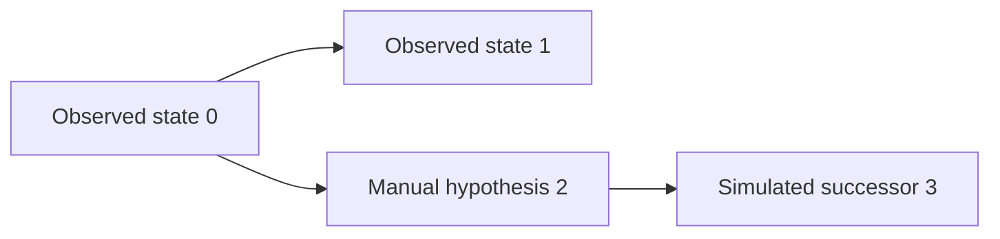

# 1 Portable Net document and forkable timeline

## 1a Accepted result and owners

The Navigator accepted one Net document with a required definition, optional
layout, and optional parent-linked timeline of complete markings. The candidate
promoted to [CV20.DS3](../../roadmap/cv20-approachable-petrus/cv20-ds3-live-understanding.md)
on 2026-08-27. The [Net document specification](../../../../spec/net-document-v1.md)
owns the current fields, validation, provenance, examples, and compatibility.

This exploration preserves why the project chose that format and the evidence
that led to promotion. The glossary now calls the concepts Layout and Timeline;
`view` and `lineage` are the serialized field names.

## 1b Problem and choice

The pinned Hamsterdan V5 case had 108 places, 137 transitions, and 570 arcs.
The earlier inspection route opened a static SVG. Definition, capture,
simulation, and editor formats also made consumers implement separate models
for closely related work.

One document lets Arx arrange a definition before execution, inspect observed
states, and append hypothetical descendants. Each entry carries its complete
sparse marking, so selecting a state needs no replay or checkpoint reconstruction.
Metadata can retain History context for diagnosis; it cannot become an
alternative state or ancestry authority.

Provenance belongs to each entry. A person-authored marking is manual; a
successor computed by Petrus is simulated, even when its parent is manual or a
person selected the transition. Observed entries are protected from in-place
editing; exploration appends a child.

Runtime History remains one linear append-only log per Instance. A document's
branching timeline is a projection for inspection and hypotheses, with no
production authenticity or resume authority.

## 1c Ownership

Petrus owns the portable format, definition identity, marking/token rules,
strict parsing, serialization, and materialization. Arx owns the canvas,
arrangement, navigation, manual forks, simulation requests, and file custody.
Hamsterdan owns V5 bindings and application acceptance. These responsibilities
are the promotion rationale; current implementation details belong in the
specification and Delivery Story.

## 1d Historical delivery evidence

- Petrus owner fixtures cover definition-only, mixed lineage, observed
  materialization, simulated materialization, and strict invalid lineage.
- Petrus `scripts/check full` passed all static and structural gates with
  **2,456 tests passed**.
- Arx `pnpm check` passed all typechecks, lint/style/dependency checks,
  **1,144 tests**, **49/49 conformance checks**, and its production build.
- Arx opened the exact Hamsterdan V5 document, rendered 108 places, 137
  transitions, and 570 arcs, then preserved arrangement through Save As and
  reopen without changing definition identity
  `70e3778ec802435a8e57456cc7e4edce04be30b91a6a65e53afa0d122f47e1e2`.
- The shared workspace also navigated direct markings, appended and edited a
  manual child, and appended a Petrus-hosted simulated lineage below a manual
  parent.

These are the runs recorded for the promoted candidate at the revisions in
frontmatter. They do not certify the current checkout.

## 1e Remaining application-bound work

The accepted `implementation-free-v1` simulator is a detached pure-Net profile.
At the recorded V5 acceptance, it refused the Python handlers and the net's
size above its 128-transition and 512-arc limits. Production Petrus could run
V5 with Hamsterdan-owned bindings; that was a different route.

CV20.DS3 owns the remaining application-bound targeted simulation and live
correlation. The intended simulation uses real bindings while pausing external
effects for hypothetical inputs and appends the computed successor to the same
timeline. This exploration does not mark that follow-up delivered.

## 1f Superseded experiments

The initial candidate retained capture/simulation anchors, record facts,
replay-derived markings, and checkpoints. The Navigator replaced it before
release with complete direct markings to reduce consumer logic. The retained
experiment files are historical evidence for that rejected complexity, not
current protocol examples. Follow the specification and CV20.DS3 for new work.
